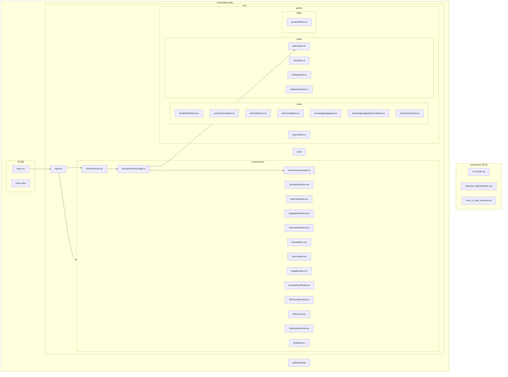
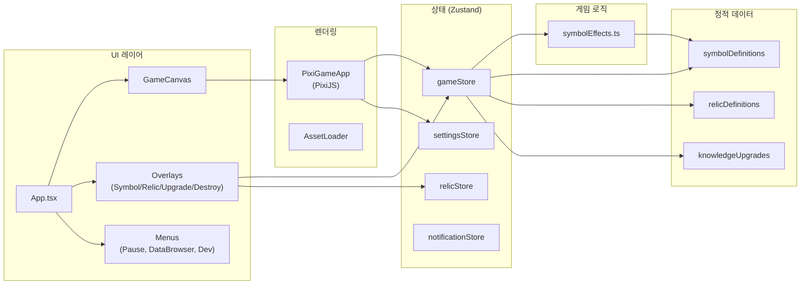
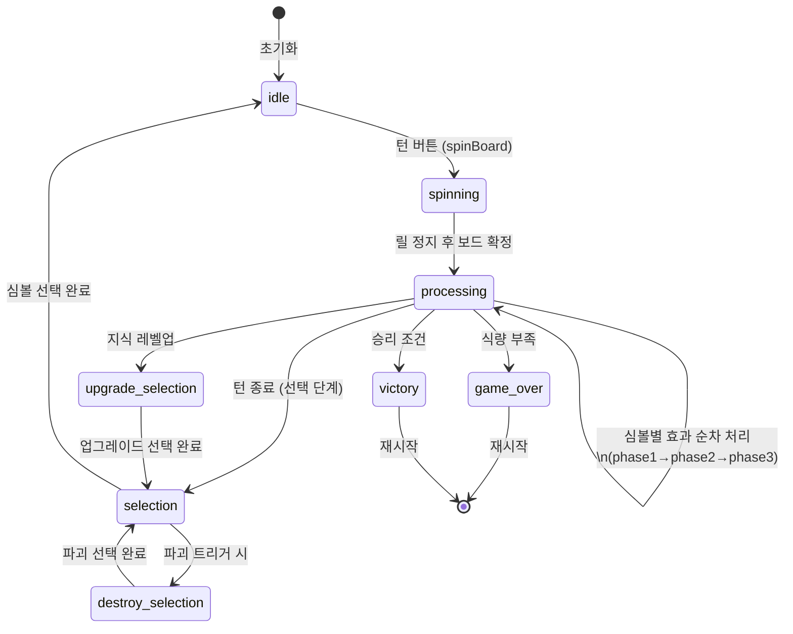
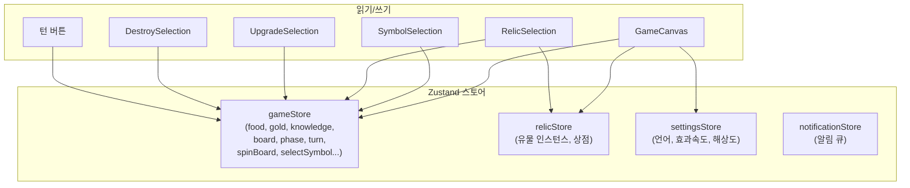
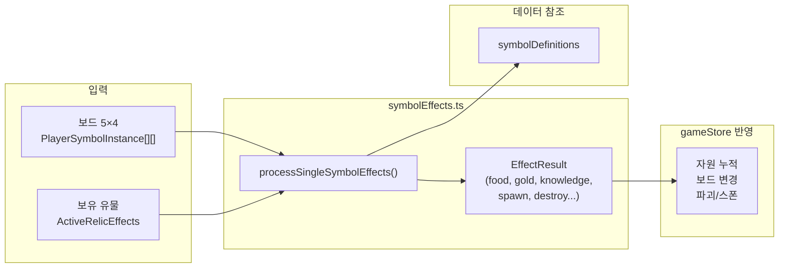

# HUMANKIND 코드베이스 비주얼 다이어그램

문명 테마 아케이드 로그라이크 슬롯 게임 코드베이스의 구조와 데이터 흐름을 다이어그램으로 정리했습니다.

---

## 1. 프로젝트 구조 (폴더/모듈)



---

## 2. 아키텍처 개요 (레이어 관계)



---

## 3. 게임 페이즈 흐름 (Core Loop)



---

## 4. 스토어와 컴포넌트 데이터 흐름



---

## 5. 게임 로직 파이프라인 (processing 단계)



---

## 6. 핵심 타입/엔티티 관계

```mermaid
erDiagram
    GameState ||--o{ PlayerSymbolInstance : "board"
    GameState ||--o{ GameEventLogEntry : "eventLog"
    GameState }o-- KnowledgeUpgrade : "선택된 업그레이드"
    SymbolDefinition ||--o{ PlayerSymbolInstance : "definition"
    RelicDefinition ||--o{ RelicInstance : "relicStore"
    processSingleSymbolEffects ||.. SymbolDefinition : "참조"
    processSingleSymbolEffects ||.. ActiveRelicEffects : "참조"

    GameState {
        number food
        number gold
        number knowledge
        number turn
        string phase
        array board
    }

    PlayerSymbolInstance {
        SymbolDefinition definition
        string instanceId
        number effect_counter
        boolean is_marked_for_destruction
    }

    SymbolDefinition {
        number id
        string name
        number symbolType
        number food
        number gold
        number knowledge
    }
```

---

## 7. 파일별 역할 요약

| 영역 | 파일 | 역할 |
|------|------|------|
| **진입** | `main.tsx`, `App.tsx` | React 루트, 레이아웃, 오버레이 조합 |
| **렌더** | `GameCanvas.tsx`, `PixiGameApp.ts`, `AssetLoader.ts` | PixiJS 보드·릴·이펙트·애니메이션 |
| **상태** | `gameStore.ts` | 게임 상태, 턴/페이즈, spinBoard·선택 로직 |
| **상태** | `relicStore.ts` | 유물 인스턴스, 상점 열기/새로고침 |
| **상태** | `settingsStore.ts` | 언어, 효과/스핀 속도, 해상도 |
| **상태** | `notificationStore.ts` | 인게임 알림 |
| **로직** | `symbolEffects.ts` | 심볼별 효과 계산 (인접, 유물 연동) |
| **데이터** | `symbolDefinitions.ts`, `symbolCandidates.ts` | 심볼 정의·후보 |
| **데이터** | `relicDefinitions.ts`, `relicCandidates.ts` | 유물 정의·후보 |
| **데이터** | `knowledgeUpgrades.ts`, `knowledgeUpgradeCandidates.ts` | 지식 업그레이드 |
| **타입** | `types/index.ts` | PlayerSymbolInstance 등 공용 타입 |

---

*이 문서는 코드베이스 탐색 결과를 바탕으로 생성되었습니다. 실제 코드와 차이가 있으면 소스为准로 하세요.*
