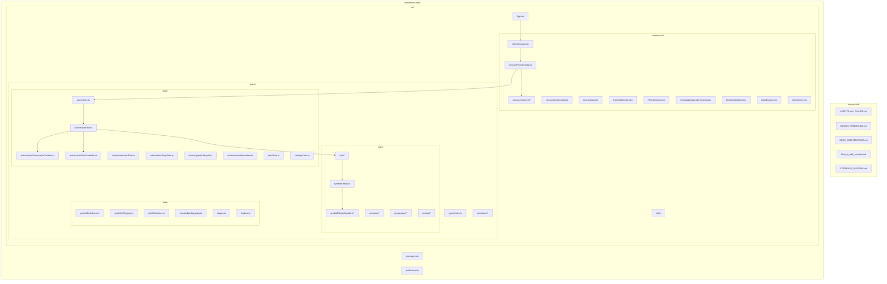
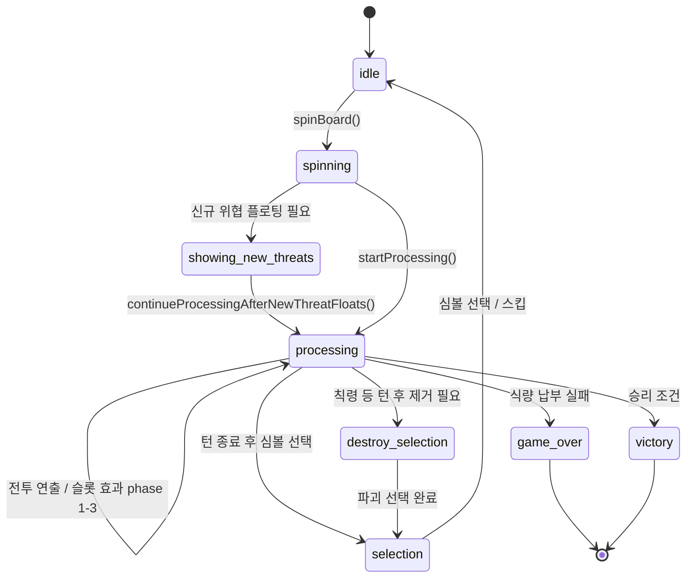
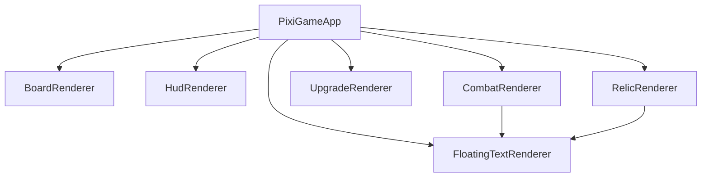
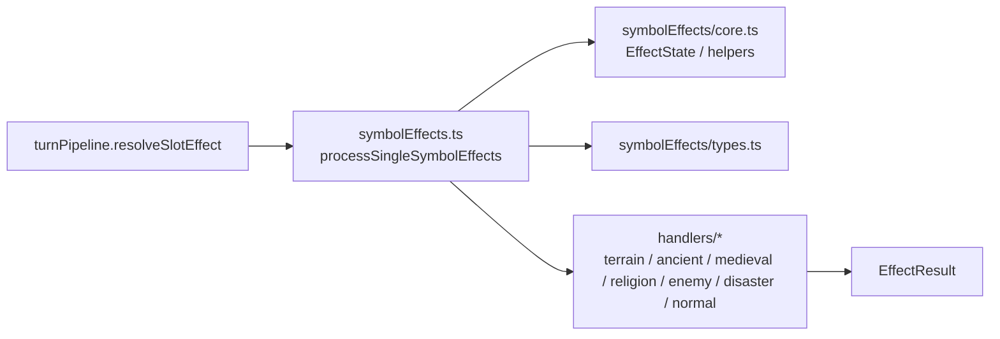

# HUMANKIND 코드베이스 구조 다이어그램

문명 테마 아케이드 로그라이크 슬롯 게임의 현재 코드 구조와 주요 데이터 흐름을 정리한 문서입니다.

---

## 1. 프로젝트 구조



---

## 2. 레이어 관계

```mermaid
flowchart LR
    subgraph UI["React UI"]
        App["App.tsx"]
        GameCanvas["GameCanvas"]
        Overlays["선택/유물/업그레이드/파괴 오버레이"]
        Tools["DataBrowser / DevOverlay / PauseMenu"]
    end

    subgraph Pixi["Pixi 렌더링"]
        PixiGameApp["PixiGameApp\n생명주기·렌더 순서 조율"]
        BoardRenderer["BoardRenderer"]
        HudRenderer["HudRenderer"]
        RelicRenderer["RelicRenderer"]
        UpgradeRenderer["UpgradeRenderer"]
        FloatingTextRenderer["FloatingTextRenderer"]
        CombatRenderer["CombatRenderer"]
        AssetLoader["AssetLoader"]
    end

    subgraph Store["Zustand 상태"]
        GameStore["gameStore"]
        RelicStore["relicStore"]
        SettingsStore["settingsStore"]
        PreGameStore["preGameStore"]
    end

    subgraph Turn["턴 처리"]
        TurnFlow["turnFlow actions"]
        TurnPipeline["turnPipeline\n계산 결과 누적"]
        TurnPresentation["turnPresentationTimeline\n연출 지연 계획"]
        TurnScheduler["turnRunScheduler\nrun id / cancel token"]
    end

    subgraph Logic["순수 로직"]
        Preparation["turnPreparation"]
        Combat["combatResolution"]
        Effects["symbolEffects + handlers"]
        PostHooks["postEffectsHooks"]
        PhaseResolution["phaseResolution"]
        Era["eraTransition"]
        Selection["selectionLogic"]
    end

    UI --> Pixi
    UI --> Store
    Pixi --> Store
    Store --> Turn
    TurnFlow --> TurnPipeline
    TurnFlow --> TurnPresentation
    TurnFlow --> TurnScheduler
    TurnFlow --> Logic
    Logic --> Simulation["simulation/balanceSimulator\n헤드리스 밸런스 분석"]
```



---

## 3. 턴 처리 흐름



### 턴 처리 책임 분리

| 영역 | 파일 | 책임 |
|------|------|------|
| 턴 액션 오케스트레이션 | `src/game/state/actions/turnFlow.ts` | 상태 변경 순서, 계산 파이프라인 호출, 연출 타임라인 실행 |
| 계산 파이프라인 | `src/game/logic/turn/turnPipeline.ts` | 슬롯 순서, 심볼 효과 계산 결과 누적, 생성/파괴 결과 적용 |
| 연출 타임라인 | `src/game/state/actions/turnPresentationTimeline.ts` | 효과 속도별 phase 지연, 전투 bounce 지연 계획 |
| run 취소 | `src/game/state/actions/turnRunScheduler.ts` | `setTimeout` 콜백에 run id/cancel token 부여, 이전 run 무효화 |
| 후처리 | `src/game/logic/turn/postEffectsHooks.ts` | 전체 효과 집계 이후 유물/리더/특수 후처리 |
| 턴 종료 판정 | `src/game/logic/turn/phaseResolution.ts` | 식량 납부, 게임오버, 선택/파괴 페이즈 결정 |

---

## 4. Pixi 렌더러 분할

`PixiGameApp.ts`는 Pixi 앱 생명주기, 컨테이너 순서, ticker, 상태 동기화만 담당합니다. 실제 렌더링 책임은 `src/components/canvas/renderers/` 아래 클래스로 나뉩니다.

| 렌더러 | 책임 |
|--------|------|
| `BoardRenderer` | 화면 크기 기반 보드 레이아웃, 배경, 슬롯 셀/번호 |
| `HudRenderer` | Pixi HUD 컨테이너 관리. 현재 주요 HUD는 React가 담당 |
| `RelicRenderer` | 유물 아이콘, hit area, hover 재동기화, 유물 플로팅 위치 계산 |
| `UpgradeRenderer` | 업그레이드 hover 어댑터. 현재 업그레이드 트리는 React 오버레이가 담당 |
| `FloatingTextRenderer` | 자원 증감, 전투, 유물, 신규 위협 플로팅 텍스트와 ticker 이동 |
| `CombatRenderer` | 전투 bounce, 흔들림, 타격 피해 플로팅 |
| `rendererShared` | 공통 커서, asset base URL, 보드 인접/상호작용 판정 헬퍼 |



---

## 5. 심볼 효과 처리 구조



심볼 ID별 효과는 단일 거대 switch로 관리하지 않고, 시대/성격별 handler 파일에 분리합니다. 새 심볼을 추가할 때는 정의/번역/에셋 외에 적절한 handler 파일과 관련 테스트를 같이 갱신합니다.

---

## 6. 핵심 타입/엔티티 관계

```mermaid
erDiagram
    GameState ||--o{ PlayerSymbolInstance : "board/playerSymbols"
    GameState ||--o{ GameEventLogEntry : "eventLog"
    GameState }o-- KnowledgeUpgrade : "unlockedKnowledgeUpgrades"
    SymbolDefinition ||--o{ PlayerSymbolInstance : "definition"
    RelicDefinition ||--o{ RelicInstance : "definition"
    TurnPipeline ||.. EffectResult : "accumulates"
    processSingleSymbolEffects ||.. SymbolDefinition : "reads"
    processSingleSymbolEffects ||.. ActiveRelicEffects : "reads"

    GameState {
        number food
        number gold
        number knowledge
        number turn
        string phase
        array board
    }

    PlayerSymbolInstance {
        SymbolDefinition definition
        string instanceId
        number effect_counter
        boolean is_marked_for_destruction
        number enemy_hp
    }

    SymbolDefinition {
        number id
        string key
        string sprite
        number food
        number gold
        number knowledge
    }
```

---

## 7. 파일별 역할 요약

| 영역 | 파일 | 역할 |
|------|------|------|
| 진입 | `main.tsx`, `App.tsx` | React 루트, 전체 레이아웃, 오버레이 조합 |
| 캔버스 | `GameCanvas.tsx` | React와 PixiGameApp 연결, hover tooltip 브릿지 |
| Pixi 앱 | `canvas/PixiGameApp.ts` | Pixi 생명주기, ticker, 컨테이너 순서, 렌더러 조율 |
| Pixi 렌더러 | `canvas/renderers/*` | 보드/HUD/유물/업그레이드/플로팅/전투 단위 렌더링 |
| 에셋 | `canvas/AssetLoader.ts` | 심볼/유물/업그레이드 스프라이트 로드 |
| 상태 | `gameStore.ts` | GameState 타입과 store 조립 |
| 상태 액션 | `state/actions/*` | 턴, 선택, 유물 상점, 클릭 유물, 라이프사이클, 보드 상호작용 |
| 턴 로직 | `logic/turn/*` | 턴 준비, 슬롯 효과 파이프라인, 전투, 후처리, 종료 페이즈 |
| 심볼 효과 | `logic/symbolEffects.ts`, `logic/symbolEffects/handlers/*` | 심볼 효과 엔트리와 시대/성격별 handler |
| 선택 로직 | `logic/selection/*` | 심볼 선택 후보 생성, 확률 계산 |
| 진행 | `logic/progression/*` | 지식/레벨/시대 전환 |
| 시뮬레이션 | `simulation/balanceSimulator.ts` | 시드 기반 자동 플레이와 생존율/픽 통계 집계 |
| 데이터 | `data/*` | 심볼, 유물, 지식 업그레이드, 스테이지, 리더 정의 |
| i18n | `i18n/index.ts` | 한국어/영어 UI 및 데이터 문자열 |

---

*이 문서는 현재 코드 기준의 작업 문서입니다. 실제 동작 판단은 소스와 테스트를 우선합니다.*
