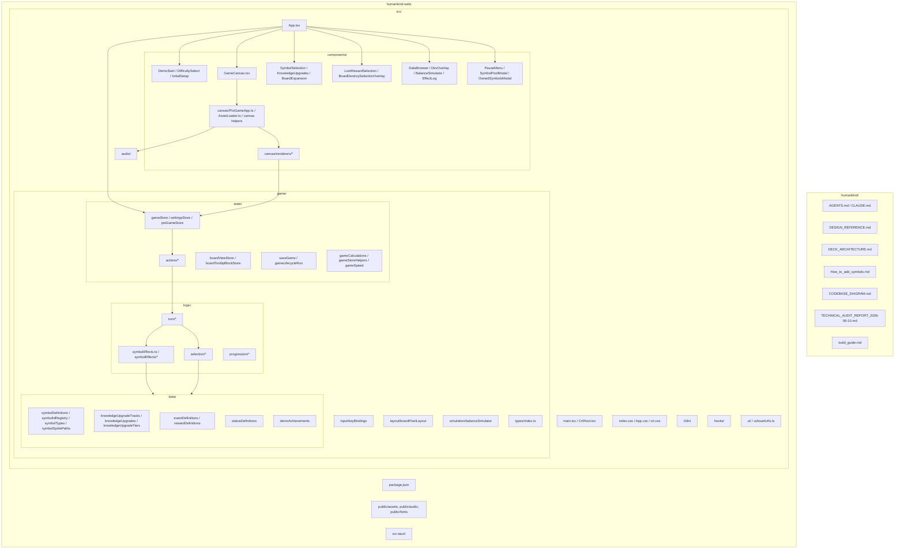
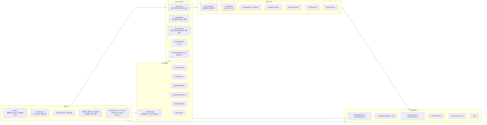
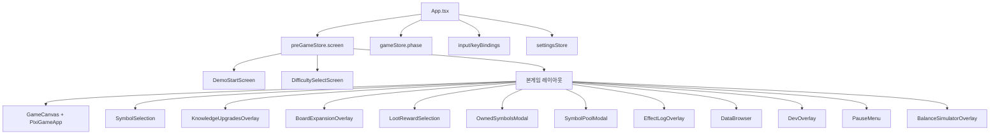
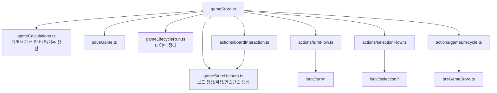
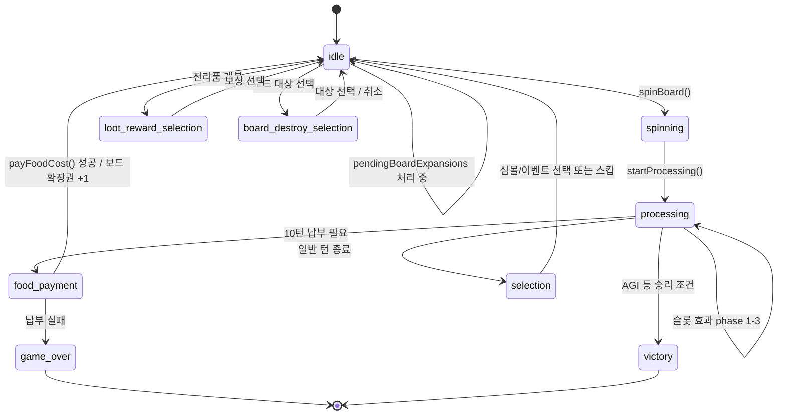
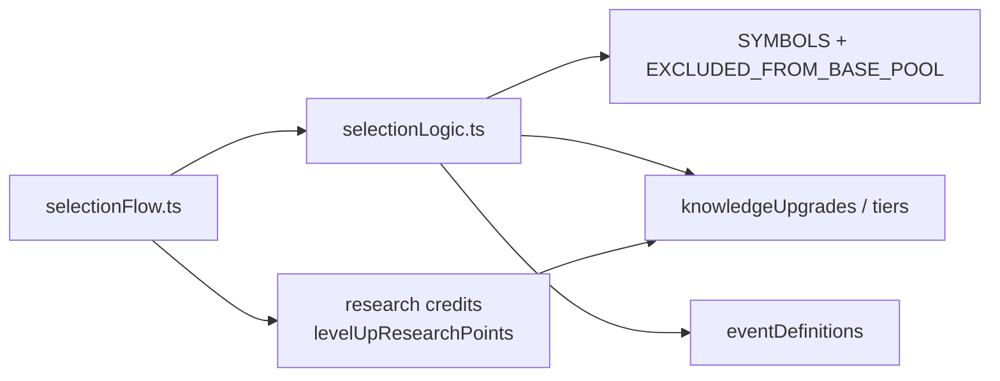
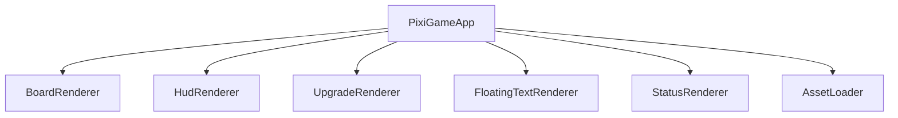

# HUMANKIND 코드베이스 구조 다이어그램

문명 테마 아케이드 로그라이크 슬롯 게임의 현재 코드 구조와 주요 데이터 흐름을 정리한 작업 문서입니다.
실제 동작 판단은 소스와 테스트를 우선합니다.

---

## 1. 프로젝트 구조

```mermaid
flowchart TB
    subgraph root["humankind/"]
        AGENTS["AGENTS.md / CLAUDE.md"]
        DESIGN["DESIGN_REFERENCE.md"]
        DECK["DECK_ARCHITECTURE.md"]
        HOW["How_to_add_symbols.md"]
        CODEBASE["CODEBASE_DIAGRAM.md"]
        AUDIT["TECHNICAL_AUDIT_REPORT_2026-06-10.md"]
        BUILD["build_guide.md"]
    end

    subgraph web["humankind-web/"]
        pkg["package.json"]
        publicAssets["public/assets, public/audio, public/fonts"]
        tauri["src-tauri/"]

        subgraph src["src/"]
            main["main.tsx / CrtRoot.tsx"]
            app["App.tsx"]
            styles["index.css / App.css / crt.css"]
            i18n["i18n/"]
            audio["audio/"]
            hooks["hooks/"]
            uiUtils["ui/ / uiAssetUrls.ts"]

            subgraph components["components/"]
                screens["DemoStart / DifficultySelect / InitialSetup"]
                canvasBridge["GameCanvas.tsx"]
                pixi["canvas/PixiGameApp.ts / AssetLoader.ts / canvas helpers"]
                renderers["canvas/renderers/*"]
                overlays["SymbolSelection / KnowledgeUpgrades / BoardExpansion"]
                boardActions["LootRewardSelection / BoardDestroySelectionOverlay"]
                tools["DataBrowser / DevOverlay / BalanceSimulator / EffectLog"]
                modals["PauseMenu / SymbolPoolModal / OwnedSymbolsModal"]
            end

            subgraph game["game/"]
                subgraph state["state/"]
                    stores["gameStore / settingsStore / preGameStore"]
                    viewStores["boardViewStore / boardTooltipBlockStore"]
                    persistence["saveGame / gameLifecycleRun"]
                    calculations["gameCalculations / gameStoreHelpers / gameSpeed"]
                    actions["actions/*"]
                end

                subgraph logic["logic/"]
                    turn["turn/*"]
                    effects["symbolEffects.ts / symbolEffects/*"]
                    selection["selection/*"]
                    progression["progression/*"]
                end

                subgraph data["data/"]
                    symbols["symbolDefinitions / symbolIdRegistry / symbolTypes / symbolSpritePaths"]
                    upgrades["knowledgeUpgradeTracks / knowledgeUpgrades / knowledgeUpgradeTiers"]
                    events["eventDefinitions / rewardDefinitions"]
                    threats["statusDefinitions"]
                    achievements["demoAchievements"]
                end

                input["input/keyBindings"]
                layout["layout/boardPixelLayout"]
                simulation["simulation/balanceSimulator"]
                types["types/index.ts"]
            end
        end
    end

    app --> screens
    app --> canvasBridge
    app --> overlays
    app --> boardActions
    app --> tools
    app --> modals
    app --> stores
    canvasBridge --> pixi
    pixi --> renderers
    pixi --> audio
    renderers --> stores
    stores --> actions
    actions --> turn
    turn --> effects
    turn --> selection
    effects --> data
    selection --> data
```

---

## 2. 런타임 레이어 관계

```mermaid
flowchart LR
    subgraph React["React UI"]
        App["App.tsx\n화면 전환, 단축키, 오버레이 조합"]
        GameCanvas["GameCanvas\nPixi 브릿지, 툴팁 포털"]
        Screens["데모/난이도/초기 설정 화면"]
        Overlays["선택/업그레이드/보드 확장/전리품/보드 대상 선택"]
        Tools["DataBrowser / DevOverlay / BalanceSimulator / EffectLog"]
    end

    subgraph Pixi["Pixi 렌더링"]
        PixiGameApp["PixiGameApp\n앱 생명주기, ticker, 렌더 순서"]
        BoardRenderer["BoardRenderer"]
        HudRenderer["HudRenderer"]
        UpgradeRenderer["UpgradeRenderer"]
        FloatingTextRenderer["FloatingTextRenderer"]
        StatusRenderer["StatusRenderer"]
        AssetLoader["AssetLoader"]
    end

    subgraph Stores["Zustand 상태"]
        GameStore["gameStore\n게임 본체 상태 + 액션 조립"]
        SettingsStore["settingsStore\n언어/해상도/속도/키 설정"]
        PreGameStore["preGameStore\n인트로/튜토리얼/난이도 선택 흐름"]
        BoardViewStore["boardViewStore\n보드 줌"]
        TooltipBlockStore["boardTooltipBlockStore\n툴팁 차단"]
    end

    subgraph PureLogic["순수 로직"]
        TurnPrep["turnPreparation\n랜덤 배치, 재해 생성"]
        TurnPipeline["turnPipeline\n슬롯 효과 누적"]
        SymbolEffects["symbolEffects + handlers"]
        PostHooks["postEffectsHooks"]
        PhaseResolution["phaseResolution"]
        EraTransition["eraTransition"]
        SelectionLogic["selectionLogic"]
    end

    subgraph StaticData["정적 데이터"]
        Symbols["symbolDefinitions / symbolIdRegistry"]
        Knowledge["knowledgeUpgrades / tiers"]
        Events["eventDefinitions / rewardDefinitions"]
        Threats["statusDefinitions"]
        Achievements["demoAchievements"]
        I18n["i18n"]
    end

    React --> Stores
    React --> Pixi
    Pixi --> Stores
    Pixi --> AssetLoader
    GameStore --> PureLogic
    PureLogic --> StaticData
    React --> StaticData
    Pixi --> StaticData
```

---

## 3. App와 화면/오버레이 흐름

```mermaid
flowchart TB
    App["App.tsx"]
    PreGame["preGameStore.screen"]
    GamePhase["gameStore.phase"]
    Input["input/keyBindings"]
    Settings["settingsStore"]

    App --> PreGame
    App --> GamePhase
    App --> Input
    App --> Settings

    PreGame --> DemoStart["DemoStartScreen"]
    PreGame --> DifficultySelect["DifficultySelectScreen"]
    PreGame --> GameRoot["본게임 레이아웃"]

    GameRoot --> GameCanvas["GameCanvas + PixiGameApp"]
    GameRoot --> SymbolSelection["SymbolSelection"]
    GameRoot --> KnowledgeOverlay["KnowledgeUpgradesOverlay"]
    GameRoot --> BoardExpansion["BoardExpansionOverlay"]
    GameRoot --> LootReward["LootRewardSelection"]
    GameRoot --> OwnedSymbols["OwnedSymbolsModal"]
    GameRoot --> SymbolPool["SymbolPoolModal"]
    GameRoot --> EffectLog["EffectLogOverlay"]
    GameRoot --> DataBrowser["DataBrowser"]
    GameRoot --> DevOverlay["DevOverlay"]
    GameRoot --> PauseMenu["PauseMenu"]
    GameRoot --> BalanceSim["BalanceSimulatorOverlay"]
```

---

## 4. 게임 상태와 액션 조립

`gameStore.ts`는 `GameState` 타입과 Zustand store를 정의하고, 세부 행동은 `state/actions/*` 팩토리에서 조립합니다.

```mermaid
flowchart TB
    GameStore["gameStore.ts"]
    Helpers["gameStoreHelpers.ts\n보드 생성/확장/인스턴스 생성"]
    Calc["gameCalculations.ts\n레벨/시대/식량 비용/기본 생산"]
    Save["saveGame.ts"]
    LifecycleRun["gameLifecycleRun.ts\n타이머 정리"]

    GameStore --> Helpers
    GameStore --> Calc
    GameStore --> Save
    GameStore --> LifecycleRun

    GameStore --> TurnFlow["actions/turnFlow.ts"]
    GameStore --> SelectionFlow["actions/selectionFlow.ts"]
    GameStore --> BoardInteraction["actions/boardInteraction.ts"]
    GameStore --> GameLifecycle["actions/gameLifecycle.ts"]

    TurnFlow --> TurnLogic["logic/turn/*"]
    SelectionFlow --> SelectionLogic["logic/selection/*"]
    BoardInteraction --> Helpers
    GameLifecycle --> PreGame["preGameStore.ts"]
```

| 액션 파일 | 주요 책임 |
|---|---|
| `turnFlow.ts` | 턴 시작, 재해 알림, 슬롯 효과 처리, 납부 페이즈, 저장 |
| `selectionFlow.ts` | 심볼/이벤트 선택, 리롤/스킵, 연구 업그레이드 선택, 업그레이드 보상 |
| `boardInteraction.ts` | 보드 위 도축/부족 마을/전리품/칙령 등 상호작용 |
| `gameLifecycle.ts` | 게임 초기화, 드래프트 시작, 튜토리얼 배치 |

---

## 5. 턴 처리 흐름

```mermaid
stateDiagram-v2
    [*] --> idle
    idle --> spinning: spinBoard()
    spinning --> processing: startProcessing()

    processing --> processing: 슬롯 효과 phase 1-3
    processing --> food_payment: 10턴 납부 필요
    processing --> selection: 일반 턴 종료
    processing --> victory: AGI 등 승리 조건

    food_payment --> idle: payFoodCost() 성공 / 보드 확장권 +1
    food_payment --> game_over: 납부 실패
    idle --> idle: pendingBoardExpansions 처리 중
    idle --> loot_reward_selection: 전리품 개봉
    idle --> board_destroy_selection: 보드 대상 선택
    loot_reward_selection --> idle: 보상 선택
    board_destroy_selection --> idle: 대상 선택 / 취소
    selection --> idle: 심볼/이벤트 선택 또는 스킵
    game_over --> [*]
    victory --> [*]
```

| 단계 | 파일 | 책임 |
|---|---|---|
| 턴 준비 | `logic/turn/turnPreparation.ts` | 보유 심볼 랜덤 배치, 자연재해 생성 |
| 슬롯 효과 | `logic/turn/turnPipeline.ts`, `logic/turn/symbolEffectResolution.ts` | 슬롯 순서 처리, 효과 결과 누적, 생성/파괴 반영 |
| 심볼 효과 | `logic/symbolEffects.ts`, `logic/symbolEffects/handlers/*` | 지형/고대/중세/종교/재해/일반 효과 계산 |
| 후처리 | `logic/turn/postEffectsHooks.ts` | 파괴 결과 집계, 특수 후처리, AGI 승리 판정 |
| 종료 페이즈 | `logic/turn/phaseResolution.ts`, `state/actions/turnFlow.ts` | 10턴 납부, 선택 페이즈, 게임오버 전환 |
| 연출 스케줄 | `state/actions/turnPresentationTimeline.ts`, `turnRunScheduler.ts` | 효과 속도별 지연, run id/cancel token |

---

## 6. 선택/연구/이벤트 흐름

```mermaid
flowchart LR
    SelectionFlow["selectionFlow.ts"]
    SelectionLogic["selectionLogic.ts"]
    SymbolPool["SYMBOLS + EXCLUDED_FROM_BASE_POOL"]
    Upgrades["knowledgeUpgrades / tiers"]
    Events["eventDefinitions"]

    SelectionFlow --> SelectionLogic
    SelectionLogic --> SymbolPool
    SelectionLogic --> Upgrades
    SelectionLogic --> Events
    SelectionFlow --> Research["research credits\nlevelUpResearchPoints"]
    Research --> Upgrades
```

- 기본 선택지는 심볼 3장입니다. 재해(`Heatwave`) 등 상태에 따라 2장으로 줄 수 있습니다.
- 이벤트는 선택지에 확률적으로 섞이며, `Public Administration`, `Mass Media` 등이 이벤트 등장 확률을 바꿉니다.
- 연구 선택은 레벨업으로 생긴 `knowledgeResearchCredits`를 소비하며, 봉건제/현대/AGI 프로젝트는 별도 선행 조건을 갖습니다.

---

## 7. Pixi 렌더러 분할

`PixiGameApp.ts`는 Pixi 앱 생명주기, ticker, 컨테이너 순서, Zustand 상태 구독 결과 렌더링을 조율합니다.
실제 렌더링 책임은 `components/canvas/renderers/` 아래 클래스로 나뉩니다.

| 렌더러/헬퍼 | 책임 |
|---|---|
| `BoardRenderer` | 보드 배경, 슬롯 셀/번호, 보드 레이아웃 |
| `HudRenderer` | Pixi HUD 컨테이너와 hover 어댑터. 주요 HUD UI는 React가 담당 |
| `UpgradeRenderer` | 업그레이드 hover 어댑터. 트리 UI는 React 오버레이가 담당 |
| `FloatingTextRenderer` | 자원/재해 플로팅 텍스트 |
| `StatusRenderer` | 재해/상태 아이콘 및 배지 |
| `rendererShared` | 공통 커서, 보드 인접/상호작용 판정, 에셋 URL 헬퍼 |
| `productionHighlightScale.ts` | 생산량 변화 기반 심볼 강조 스케일 |
| `crtProjection.ts`, `CrtScreenFilter.ts` | CRT 화면 좌표 보정과 필터 |

```mermaid
flowchart TB
    PixiGameApp["PixiGameApp"]
    PixiGameApp --> BoardRenderer
    PixiGameApp --> HudRenderer
    PixiGameApp --> UpgradeRenderer
    PixiGameApp --> FloatingTextRenderer
    PixiGameApp --> StatusRenderer
    PixiGameApp --> AssetLoader
```

---

## 8. 정적 데이터와 순수 로직

| 영역 | 주요 파일 | 역할 |
|---|---|---|
| 심볼 정의 | `data/symbolDefinitions.ts`, `symbolIdRegistry.ts`, `symbolTypes.ts`, `symbolSpritePaths.ts` | 심볼 ID/키/타입/스프라이트 경로 |
| 지식 업그레이드 | `data/knowledgeUpgradeTracks.ts`, `knowledgeUpgrades.ts`, `knowledgeUpgradeTiers.ts` | 아홉 업그레이드 카드, 카드별 레벨, 효과 ID 호환 |
| 이벤트/보상 | `data/eventDefinitions.ts`, `rewardDefinitions.ts` | 선택 이벤트, 전리품 보상 |
| 상태/재해 | `data/statusDefinitions.ts` | 자연재해 확률과 상태 배지 |
| 데모 진행 | `data/demoAchievements.ts` | 데모 업적 |
| 턴 로직 | `logic/turn/*` | 턴 준비, 슬롯 효과, 후처리, 종료 페이즈 |
| 심볼 효과 | `logic/symbolEffects.ts`, `logic/symbolEffects/handlers/*` | 심볼 효과 엔트리와 성격별 handler |
| 선택 로직 | `logic/selection/selectionLogic.ts` | 선택 풀 빌드, 이벤트 대체, 강제 선택 |
| 진행 로직 | `logic/progression/eraTransition.ts` | 지식 누적, 레벨업, 시대 계산 |
| 밸런스 시뮬레이션 | `simulation/balanceSimulator.ts` | 시드 기반 자동 플레이, 생존율/픽 통계 |

---

## 9. 핵심 타입/엔티티 관계

```mermaid
erDiagram
    GameState ||--o{ PlayerSymbolInstance : "board/playerSymbols"
    GameState ||--o{ GameEventLogEntry : "eventLog"
    GameState }o-- KnowledgeUpgrade : "unlockedKnowledgeUpgrades"
    GameState }o-- SelectionChoice : "symbolChoices"
    GameState }o-- ActiveStatusState : "activeStatuses"
    GameState }o-- RewardDefinition : "lootRewardChoices"
    SymbolDefinition ||--o{ PlayerSymbolInstance : "definition"
    TurnPipeline ||.. BoardEffectDelta : "accumulates"
    processSingleSymbolEffects ||.. SymbolDefinition : "reads"

    GameState {
        number food
        number gold
        number knowledge
        number level
        number era
        number turn
        string phase
        array board
        array playerSymbols
        array symbolChoices
        number pendingBoardExpansions
        boolean pendingFoodPayment
    }

    PlayerSymbolInstance {
        SymbolDefinition definition
        string instanceId
        number effect_counter
        boolean is_marked_for_destruction
    }

    SymbolDefinition {
        number id
        string key
        string name
        SymbolType type
        string description
        string sprite
    }
```

---

## 10. 파일별 역할 요약

| 영역 | 파일 | 역할 |
|---|---|---|
| 진입/루트 | `main.tsx`, `CrtRoot.tsx`, `App.tsx` | React 루트, CRT 래퍼, 화면 전환, 단축키, 오버레이 조합 |
| 스타일 | `index.css`, `App.css`, `crt.css`, `settingsKeyBindings.css` | 전체 UI, 오버레이, CRT, 키 설정 스타일 |
| 캔버스 브릿지 | `components/GameCanvas.tsx` | React와 PixiGameApp 연결, hover tooltip 포털 |
| 도구/모달 | `DataBrowser.tsx`, `DevOverlay.tsx`, `EffectLogOverlay.tsx`, `BalanceSimulatorOverlay.tsx`, `OwnedSymbolsModal.tsx`, `SymbolPoolModal.tsx`, `PauseMenu.tsx` | 데이터 확인, 디버그, 로그, 시뮬레이션, 메뉴 |
| 프리게임/난이도 | `DemoStartScreen.tsx`, `DifficultySelectScreen.tsx`, `InitialSetupScreen.tsx` | 데모 시작, 난이도 선택, 초기 설정 |
| 상태 | `game/state/*` | Zustand store, 저장/복원, 계산, 보드 확장, 게임 생명주기 |
| 입력/레이아웃 | `game/input/keyBindings.ts`, `game/layout/boardPixelLayout.ts` | 키 바인딩, 보드 픽셀 레이아웃 |
| 오디오 | `audio/audioManager.ts`, `audio/audioCues.ts`, `public/audio/*` | BGM/SFX 로드와 재생 큐 |
| i18n | `i18n/index.ts`, `zh.ts`, `ru.ts`, `ruFallback.ts` | 다국어 UI/데이터 문자열 |
| 유틸 | `browserBehaviorGuards.ts`, `uiAssetUrls.ts`, `ui/*`, `hooks/*` | 브라우저 기본 동작 방지, UI 에셋 경로, 커서/툴팁 유틸 |
| 패키징 | `src-tauri/*`, `scripts/packageSteamMacos.cjs` | Tauri 데스크톱 빌드와 Steam 패키징 |

---

## 11. 갱신 기준

- 새 화면/오버레이가 `App.tsx`에 직접 붙으면 3번과 10번을 갱신합니다.
- 새 Zustand store 또는 액션 파일을 추가하면 2번과 4번을 갱신합니다.
- 새 턴 처리 단계, 페이즈, 재해 규칙을 추가하면 5번과 8번을 갱신합니다.
- 새 정적 데이터 축을 추가하면 1번, 8번, 10번을 갱신합니다.
- Pixi 렌더러가 추가/분리되면 7번을 갱신합니다.
